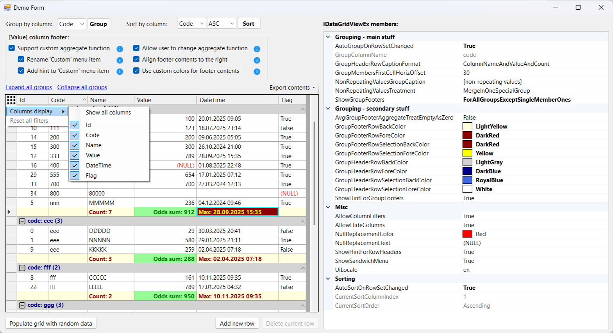

## UiTools.Controls.ExtendedDataGridView.DataGridViewEx

In many of my projects, I found it quite frustrating that the standard `System.Windows.Forms.DataGridView` lacks built-in features for row-based grouping and column-based filtering. Whenever using third-party components wasn't an option, I had to rely on "surrogate" workarounds — such as master/detail views built with two separate grids or custom-made external filtering controls. Since these were never quite as seamless as an out-of-the-box solution, and seeing that Microsoft has no plans to further evolve the `DataGridView`, I developed an extended version of this control which I’ve been using for several years. I’ve now decided to share it with the community.

My control is called `DataGridViewEx`, and it offers the following features:

* **Single-level grouping** by a specified column, allowing the user to:
  * choose how to handle non-repeating values: combine them into a single "pseudo-group", place them in individual groups (each containing a single value), or skip grouping for them entirely,
  * set custom captions for group header rows,
  * apply different formatting to headers for each row group,
  * display footers for specific columns (with the option to show them for all groups or only for non-"pseudo" groups),
  * assign footer values per column using standard aggregate functions or custom functions provided via events (with runtime function selection),
  * apply different formatting to footers for each column.
* You can specify which columns allow grouping - use the `GridColumnExtInfo.AllowGrouping` property,
* **Filtering** across one or multiple columns using a list of distinct values or criteria like "Equals", "Does not equal", "Contains", regex etc (available criteria depend on the column's data type),
* **Sorting** that respects the current grouping,
* **Column visibility management** (including the ability to specify columns that should _always_ remain hidden),
* **Exporting** grid data to CSV, HTML, PDF and Excel formats (preserving grid cells formatting),
* **Easy localization** via the `UiTools.Controls.ExtendedDataGridView.Resources.Strings.xml` file.

### Limitations:
* Only one level of grouping is supported,
* Grouping is performed **programmatically** by calling the `GroupByColumn(string colName)` method (no "Group Panel" for drag-and-drop grouping is provided); passing empty string as `colName` - removes grouping,
* Grouping is supported for the following data types (defined in the `GridColumnDataType` enum): **Text**, **Integer**, **Decimal**, **DateTime** and **Boolean**,
* Filtering is triggered via a right-click on the column header (I opted not to add a header icon to conserve space),
* The `Tag` property of the columns is reserved (see below) and cannot be used for custom purposes,
* Excel export has been tested **only with Excel 2019**,
* **Data bound mode is NOT supported**,
* For each column added, `SortMode` property is automatically set to `DataGridViewColumnSortMode.NotSortable`; otherwise custom sorting will not work properly,
* As far as grouping is made via removing/inserting rows, the performance is probably not ideal.

### Some implementation details:
* A key role is played by the `UiTools.Controls.ExtendedDataGridView.GridColumnExtInfo` class, which extends any grid column with about 15 additional properties,
  * An instance of this class is stored in the column's `Tag` property; therefore, this property is unavailable for other uses,
* The most critical aspects of the row grouping implementation are:
  * Overriding the `DataGridView.RowTemplate` property: this allows us to redefine the row type as `UiTools.Controls.ExtendedDataGridView.CustomRow`; this is essential for distinguishing between "group rows", "footer rows" and "regular rows", and rendering them differently,
  * Overriding `DataGridViewRowCollection.CreateRowsInstance()`: this provides control over the internal row collection, specifically allowing custom handling of the `RemoveAt(int index)` method for group and footer rows.
* If you occasionally place an empty string to a _numeric_ column (having `ExtInfo().IsNumeric == true`) - this value is treated as **zero** when sorting,
* Property `AvgGroupFooterAggregateTreatEmptyAsZero` (default is `false`): if set to `true`, **Avg** between `222` and `null` (or `222` and an empty string) will be calculated as `111`; if set to `false` - as `222`.
* Column filter does not affect footer values - this behavior is by design,
* **Recommendation**: before mass/batch CUD-operations it is recommended to remove grouping (via `GroupByColumn("")`) and remove sorting (via `CustomSort("")`).

### More screenshots:

Column filter:

Column visibility management:

